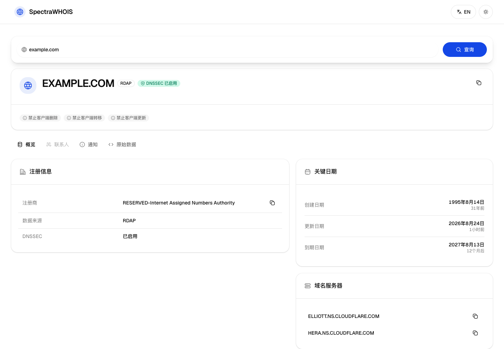

# SpectraWHOIS

<div align="center">

面向开发者、站点管理员与域名运营人员的双语域名注册信息查询工具。

[简体中文](./README.md) · [English](./README_EN.md)


</div>

SpectraWHOIS 以 RDAP（Registration Data Access Protocol）为默认数据源，通过 IANA 引导注册表发现对应的 RDAP 服务；对于部分不支持 RDAP 的顶级域，或在 RDAP 查询失败时，可通过独立部署的 Node.js 插件回退到传统 WHOIS（TCP 43 端口）。



## 目录

- [主要功能](#主要功能)
- [系统架构](#系统架构)
- [快速开始](#快速开始)
- [环境变量](#环境变量)
- [API](#api)
- [可用命令](#可用命令)
- [项目结构](#项目结构)
- [部署](#部署)
- [传统 WHOIS 插件](#传统-whois-插件)
- [开发与贡献](#开发与贡献)
- [数据与隐私说明](#数据与隐私说明)
- [已知限制](#已知限制)
- [许可证](#许可证)

## 主要功能

- **标准优先的查询流程**：优先使用 RDAP，并根据 IANA DNS 引导注册表定位服务端点。
- **传统 WHOIS 回退**：可选插件通过原生 TCP Socket 查询 43 端口，覆盖部分缺少 RDAP 的顶级域。
- **国际化域名支持**：校验并规范化输入，通过 Punycode 处理 IDN 域名。
- **结构化结果展示**：呈现注册商、状态、关键日期、域名服务器、DNSSEC、联系人、通知和原始响应。
- **中英文界面**：内置简体中文与英文，可在页面内切换。
- **本地搜索历史**：将最近查询记录保存在浏览器 `localStorage` 中，便于重复查询。
- **响应式与深色模式**：适配桌面端和移动端，并支持系统主题与减少动态效果偏好。
- **可配置品牌名**：可通过公开环境变量替换默认的 `SpectraWHOIS` 名称。

## 系统架构

```text
浏览器
  │
  ▼
Next.js 前端 ── GET /api/whois ──┬── RDAP 服务（HTTPS）
                                 │     └── IANA RDAP 引导注册表
                                 │
                                 └── WHOIS 插件（可选，HTTP）
                                       ├── IANA WHOIS 服务发现
                                       └── 权威 WHOIS 服务器（TCP 43）
```

查询规则如下：

1. 前端规范化并校验域名，然后请求项目内的 `/api/whois` 路由。
2. 对已知通常需要传统 WHOIS 的顶级域，服务端直接调用可选插件。
3. 其他域名优先查询 RDAP；若 RDAP 失败且已配置插件，再尝试传统 WHOIS。
4. 结果统一转换为前端可展示的数据结构，并标记来源为 `rdap` 或 `whois`。

## 快速开始

### 环境要求

- Node.js `>=20.9.0`
- npm（仓库包含 `package-lock.json`，建议使用 `npm ci`）

### 启动前端

```bash
git clone https://github.com/marvinli001/spectra-whois.git
cd spectra-whois
npm ci
npm run dev
```

打开 [http://localhost:3000](http://localhost:3000)。仅使用 RDAP 时，无需配置额外环境变量。

### 同时启动传统 WHOIS 插件（可选）

在另一个终端中运行：

```bash
cd whois-plugin
npm install
npm run dev
```

随后在项目根目录创建 `.env.local`：

```dotenv
NEXT_PUBLIC_WHOIS_PLUGIN_URL=http://localhost:3001/whois
```

修改环境变量后需要重新启动 Next.js 开发服务器。

> 插件需要能够访问外部 WHOIS 服务器的 TCP 43 端口。部分公司网络、云平台或网络运营商会限制这类连接。

## 环境变量

项目没有必填环境变量。下列变量均为可选配置：

| 变量 | 用途 | 默认值 |
| --- | --- | --- |
| `NEXT_PUBLIC_BRAND_NAME` | 修改页面标题与界面品牌名称 | `SpectraWHOIS` |
| `NEXT_PUBLIC_WHOIS_PLUGIN_URL` | 传统 WHOIS 插件的完整查询地址，必须包含 `/whois` | 未配置 |
| `NEXT_PUBLIC_WHOIS_API_URL` | 插件地址的兼容变量名 | 未配置 |

示例：

```dotenv
NEXT_PUBLIC_BRAND_NAME=SpectraWHOIS
NEXT_PUBLIC_WHOIS_PLUGIN_URL=https://your-plugin.example.com/whois
```

这些变量带有 `NEXT_PUBLIC_` 前缀，会进入浏览器可见的前端构建产物，因此不要在其中存放密钥或其他敏感信息。

## API

### Next.js 查询接口

```http
GET /api/whois?domain=example.com
```

常见响应状态：

| 状态码 | 含义 |
| --- | --- |
| `200` | 查询成功 |
| `400` | 缺少域名、域名格式无效，或顶级域不受支持 |
| `404` | 注册局中未找到该域名 |
| `500` | RDAP 与可用的传统 WHOIS 查询均失败 |

成功结果会包含统一后的域名数据，并通过 `source` 字段标明 `rdap` 或 `whois`。错误结果包含稳定的 `code` 与可读的 `message`。

### 传统 WHOIS 插件接口

| 方法 | 路径 | 用途 |
| --- | --- | --- |
| `GET` | `/` | 服务信息与端点列表 |
| `GET` | `/health` | 健康检查 |
| `GET` | `/whois?domain=example.com` | 查询单个域名 |
| `POST` | `/whois/batch` | 批量查询，单次最多 10 个域名 |

完整请求、响应与部署说明见 [WHOIS 插件文档](./whois-plugin/README.md)。

## 可用命令

### 前端

| 命令 | 说明 |
| --- | --- |
| `npm run dev` | 使用 Turbopack 启动开发服务器 |
| `npm run dev:webpack` | 使用 Webpack 启动开发服务器 |
| `npm run lint` | 运行 ESLint |
| `npm run typecheck` | 运行 TypeScript 静态类型检查 |
| `npm run build` | 创建生产构建 |
| `npm run start` | 启动已构建的生产服务 |

### WHOIS 插件

```bash
cd whois-plugin
npm run dev   # Node.js watch 模式
npm start     # 普通启动
npm test      # 运行需要外网与 TCP 43 的实时冒烟脚本
```

## 项目结构

```text
spectra-whois/
├── src/
│   ├── app/
│   │   ├── api/whois/           # Next.js WHOIS/RDAP 聚合接口
│   │   ├── layout.tsx           # 根布局与页面元数据
│   │   └── page.tsx             # 主查询工作台
│   ├── components/
│   │   ├── debug/               # 开发环境配置诊断
│   │   ├── ui/                  # 通用界面组件
│   │   └── whois/               # 查询、历史与结果组件
│   ├── contexts/                # 语言上下文
│   ├── hooks/                   # 搜索历史等 React Hooks
│   ├── lib/                     # 域名、国际化与通用工具
│   ├── services/                # RDAP 与传统 WHOIS 客户端
│   ├── types/                   # RDAP/WHOIS 类型
│   └── utils/                   # 环境与本地存储工具
├── public/                      # 静态资源
├── whois-plugin/                # 独立的 Express WHOIS 服务
├── DESIGN.md                    # 产品界面设计约束
├── PRODUCT.md                   # 产品定位与能力边界
└── package.json                 # 前端依赖与脚本
```

## 部署

### 前端部署到 Vercel

[](https://vercel.com/new/clone?repository-url=https%3A%2F%2Fgithub.com%2Fmarvinli001%2Fspectra-whois)

1. 导入本仓库并使用仓库根目录作为项目根目录。
2. 保持 Vercel 对 Next.js 的默认构建设置。
3. 如需传统 WHOIS，在项目环境变量中设置 `NEXT_PUBLIC_WHOIS_PLUGIN_URL`。
4. 重新部署，使公开环境变量进入前端构建产物。

### 插件部署到 Railway

[](https://railway.app/template/8YKvEb?referralCode=QluM1X)

将 Railway 服务的根目录设置为 `whois-plugin`。部署完成后，把插件的 `/whois` 完整地址写入前端环境变量。自定义前端域名还需要同步调整插件的生产 CORS 允许列表，详情见插件文档。

## 传统 WHOIS 插件

插件是一个可独立运行和部署的 Express 服务，负责 IANA WHOIS 服务发现、内存缓存、查询格式回退、TCP 连接、常见字段解析和批量请求。

- [中文插件文档](./whois-plugin/README.md)
- [English plugin documentation](./whois-plugin/README_EN.md)

如果不部署插件，RDAP 查询仍可正常使用；但已知依赖传统 WHOIS 的顶级域，以及 RDAP 失败后的回退查询将不可用。

## 开发与贡献

欢迎通过 Issue 和 Pull Request 改进项目。提交前建议完成以下检查：

```bash
npm run lint
npm run typecheck
npm run build

cd whois-plugin
npm test
```

请注意，`whois-plugin/npm test` 是依赖实时网络的冒烟脚本，不是隔离的单元测试；运行环境必须允许 DNS 解析和出站 TCP 43 连接。

推荐的贡献流程：

1. Fork 仓库并从最新代码创建功能分支。
2. 让改动保持聚焦，并为行为变化补充相应验证。
3. 确认中英文 README 在公共接口或配置发生变化时保持一致。
4. 提交 Pull Request，说明背景、改动范围、验证方式和已知限制。

## 数据与隐私说明

- 域名查询会把用户输入发送到对应的 RDAP 服务；启用插件时，也可能发送到 IANA 和权威 WHOIS 服务器。
- 查询历史与语言偏好仅保存在当前浏览器的 `localStorage` 中，可在界面中清除。
- RDAP/WHOIS 响应可能包含由注册局公开的联系信息、通知和原始协议数据；部署者应根据适用法律与服务条款决定如何记录、缓存和展示这些内容。
- 本项目本身未实现用户账户、持久化数据库或服务端查询历史存储。

## 已知限制

- 不同注册局返回的数据结构、字段完整度、速率限制和可用性并不一致。
- 传统 WHOIS 插件依赖第三方服务器与 TCP 43 网络连通性，部署成功不代表所有顶级域都可查询。
- 插件当前没有内置身份认证或速率限制；公开部署前应在反向代理或平台层增加相应保护。
- 插件的生产 CORS 允许列表目前在源码中配置，自定义域名需要修改后重新部署。

## 许可证

仓库当前未包含根级 `LICENSE` 文件，因此尚不能仅凭 README 确认整个项目的开源许可条款。`whois-plugin/package.json` 虽声明为 MIT，但在维护者补充正式许可证文件前，不应把该元数据视为完整的仓库级授权。

如准备公开分发或接受外部贡献，建议由仓库维护者先补充并确认适用的许可证。
